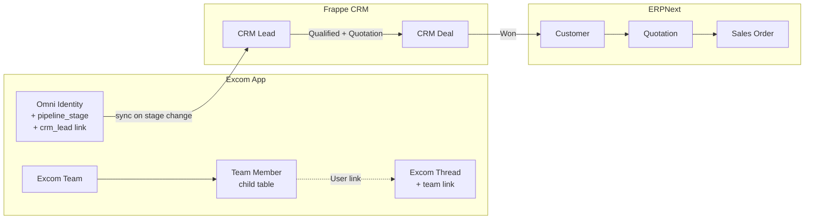
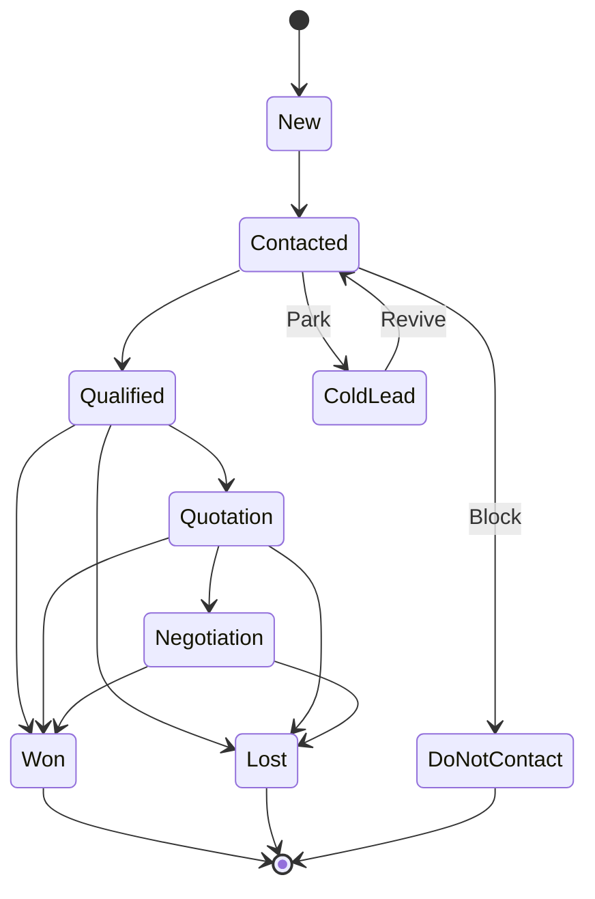
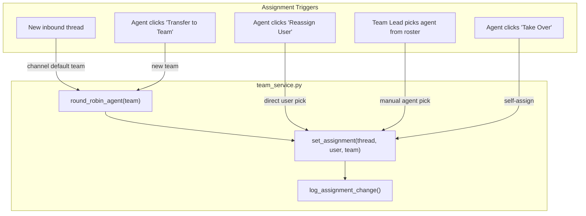

# Phase 3.5: Pipeline, Teams, and CRM Sync

Priority: MEDIUM-HIGH
Estimated Effort: 10-14 days
Dependency: Phase 2 (frontend functional), Phase 1 (service layer)

---

## Objective

Build a strict single-direction sales pipeline inside Excom that syncs to Frappe CRM, alongside a lightweight User-based team management system for field sales and telesales — all accessible from the Excom chat interface without context-switching. Users are not Employees, so ERPNext Department/Sales Person hierarchy cannot be used; the team model is built directly on Frappe Users.

---

## Current State

- **Excom Thread** has `assigned_to` (single User link) and basic `status` (Open/Pending/Closed) — no pipeline or team concept.
- **Omni Identity** links to ERP entities (Customer, Supplier, Lead, Contact) via `Omni Identity Link` child table — no pipeline stage tracking.
- **Frappe CRM** is installed with `CRM Lead` (status is a configurable Link to `CRM Lead Status`) and `CRM Deal` — but no connection to Excom.
- **ERPNext Lead** has 9 freeform statuses — too open, not enforcing a funnel.
- **Users are not Employees** — ERPNext Department/Sales Person hierarchy cannot be used.
- **Transactions tab** already shows Quotation, SO, DN, SI, RFQ, PO, PR, PI from linked Customer/Supplier (Phase 3 work).

---

## Architecture

---

## 3.5.1 Pipeline System — Strict Single-Direction Stages

Pipeline stage is stored on **Omni Identity** (person-level, not thread-level — the same person across all channels has ONE pipeline position).

### Stage Flow

### Allowed Transitions (enforced server-side)

| Current Stage    | Allowed Next Stages                   |
|------------------|---------------------------------------|
| New              | Contacted                             |
| Contacted        | Qualified, Cold Lead, Do Not Contact  |
| Cold Lead        | Contacted (revive only)               |
| Qualified        | Quotation, Won, Lost                  |
| Quotation        | Negotiation, Won, Lost                |
| Negotiation      | Won, Lost                             |
| Won              | Terminal (no forward moves)           |
| Lost             | Terminal (no forward moves)           |
| Do Not Contact   | Terminal (no forward moves)           |

### Omni Identity — New Pipeline Fields

Add to `excom/excom/doctype/omni_identity/omni_identity.json`:

| Field              | Type               | Purpose                                          |
|--------------------|--------------------|--------------------------------------------------|
| pipeline_stage     | Select             | New / Contacted / Qualified / Cold Lead / Do Not Contact / Quotation / Negotiation / Won / Lost (default "New") |
| crm_lead           | Link: CRM Lead     | Auto-populated on sync (read-only)               |
| crm_deal           | Link: CRM Deal     | Auto-populated on sync (read-only)               |
| pipeline_changed_at| Datetime           | When stage last changed (read-only)              |
| pipeline_changed_by| Link: User         | Who changed the stage (read-only)                |

- **Complexity:** Medium

---

## 3.5.2 Team Management

User-based team system (not Employee-based). Enables field sales and telesales grouping without requiring Employee records.

### Excom Team (new DocType)

Path: `excom/excom/doctype/excom_team/`

| Field                | Type                  | Purpose                                     |
|----------------------|-----------------------|---------------------------------------------|
| team_name            | Data (required, unique)| Human-readable team name                   |
| team_type            | Select                | Sales / Support / Mixed                     |
| is_enabled           | Check (default 1)     | Active toggle                               |
| description          | Small Text            | Team purpose or notes                       |
| default_for_channel  | Link: Excom Channel   | Auto-assign new threads on this channel     |
| members              | Table: Excom Team Member | Team membership                          |

### Excom Team Member (child table)

| Field                    | Type              | Purpose                          |
|--------------------------|-------------------|----------------------------------|
| user                     | Link: User (required) | Team member                  |
| role                     | Select            | Agent / Team Lead / Manager      |
| is_active                | Check (default 1) | Active toggle                    |
| max_concurrent_threads   | Int (default 0)   | 0 = unlimited                    |

### Excom Thread — New Field

Add to `excom/excom/doctype/excom_thread/excom_thread.json`:

| Field | Type             | Purpose                    |
|-------|------------------|----------------------------|
| team  | Link: Excom Team | Which team owns this thread|

- **Complexity:** Medium

---

## 3.5.3 Assignment Engine

All assignment operations go through `excom/excom/services/team_service.py` which enforces rules and publishes realtime events.

### Five Assignment Flows

### team_service.py Functions

- `reassign_thread(thread_name, target_user=None, target_team=None, auto_assign=True)` — single entry point for ALL reassignment:
  - If `target_user` provided: set `assigned_to = target_user`. If `target_team` also provided, set `thread.team = target_team`; otherwise keep existing team.
  - If only `target_team` provided and `auto_assign=True`: set `thread.team = target_team`, call `round_robin_agent(target_team)` to pick the agent, set `assigned_to`.
  - If only `target_team` provided and `auto_assign=False`: set `thread.team = target_team`, clear `assigned_to` (thread goes to team queue, unassigned).
  - Publishes `excom:thread_updated` with `{thread, event: "reassigned", assigned_to, team}`.
  - Calls `log_assignment_change()`.

- `take_over_thread(thread_name, user=None)` — shortcut: assigns to `user` (default: current session user), keeps existing team.

- `round_robin_agent(team_name)` — finds the active team member with the fewest assigned open threads. Respects `max_concurrent_threads` (0 = unlimited). Returns `None` if all members are at capacity.

- `get_team_roster(team_name)` — returns all active members with their current open thread count, for the manual agent picker UI.

- `get_team_dashboard(team_name)` — returns members with open thread count, pipeline stage distribution, avg response time.

### Excom Assignment Log (new DocType, standalone)

Path: `excom/excom/doctype/excom_assignment_log/`

Audit trail for every assignment change on a thread.

| Field          | Type              | Purpose                                           |
|----------------|-------------------|----------------------------------------------------|
| thread         | Link: Excom Thread| Related thread (required)                          |
| assigned_user  | Link: User        | Who was assigned                                   |
| assigned_team  | Link: Excom Team  | Which team                                         |
| assigned_by    | Link: User        | Who made the change (or "System" for auto)         |
| reason         | Select            | Auto Round Robin / Manual / Transfer / Take Over / System Default |
| previous_user  | Link: User        | Who was previously assigned                        |
| previous_team  | Link: Excom Team  | Previous team                                      |
| note           | Small Text        | Optional reason text                               |

### Auto-Assignment on New Inbound

Modify `ingest_inbound_message()` in `excom/excom/services/thread_service.py`: after creating a new thread, check if the thread's channel has a default team (`Excom Team.default_for_channel`). If so, call `reassign_thread(thread, target_team=default_team, auto_assign=True)`.

- **Complexity:** High

---

## 3.5.4 CRM Sync

Agents never touch Frappe CRM directly — sync is triggered automatically from `advance_stage()`.

### Pipeline Service

New file: `excom/excom/services/pipeline_service.py`

- `advance_stage(omni_identity, new_stage, user)` — validates transition against the allowed-transitions matrix, updates `pipeline_stage`, `pipeline_changed_at`, `pipeline_changed_by`, triggers CRM sync.
- `get_pipeline_summary(filters)` — returns stage counts for dashboard/kanban.
- Validation: raises `frappe.ValidationError` if transition is not in the allowed matrix.

### CRM Sync Service

New file: `excom/excom/services/crm_sync_service.py`

- `sync_to_crm_lead(omni_identity)` — creates or updates a `CRM Lead` from the Omni Identity data (display_name, phone, email, pipeline_stage mapped to CRM Lead Status). Sets `lead_owner` to the thread's `assigned_to`.
- `sync_to_crm_deal(omni_identity)` — when stage reaches Quotation, creates a `CRM Deal` from the CRM Lead. Links back to the Omni Identity.
- `ensure_crm_lead_statuses()` — fixture-style function that creates matching `CRM Lead Status` records if they don't exist.

### CRM Lead Status Seeds

On `bench migrate` (via `after_migrate` hook), call `ensure_crm_lead_statuses()`:

| Status          | Color  | Position |
|-----------------|--------|----------|
| New             | gray   | 1        |
| Contacted       | blue   | 2        |
| Qualified       | green  | 3        |
| Cold Lead       | cyan   | 4        |
| Do Not Contact  | red    | 5        |
| Quotation       | orange | 6        |
| Negotiation     | amber  | 7        |
| Won             | green  | 8        |
| Lost            | red    | 9        |

- **Complexity:** High

---

## 3.5.5 Pipeline and Team API Endpoints

Add to `excom/excom/api/chat.py`:

### Pipeline APIs

| Endpoint                                         | Purpose                                                    |
|--------------------------------------------------|------------------------------------------------------------|
| `advance_pipeline_stage(omni_identity, new_stage)` | Wrapper around `pipeline_service.advance_stage()`          |
| `get_pipeline_stages(omni_identity)`              | Returns current stage + allowed next stages                |
| `get_pipeline_overview()`                         | Returns `{stage: count}` for all active identities (kanban)|

### Team and Assignment APIs

| Endpoint                                                                      | Purpose                                                    |
|-------------------------------------------------------------------------------|------------------------------------------------------------|
| `get_teams()`                                                                 | Returns all enabled teams with member counts + active thread counts |
| `reassign_thread(thread_id, target_user, target_team, auto_assign)`           | Wrapper around `team_service.reassign_thread()`            |
| `take_over_thread(thread_id)`                                                 | Wire to `team_service.take_over_thread()`                  |
| `get_team_roster(team)`                                                       | Returns members + workload for agent picker dropdown       |
| `get_assignment_history(thread_id)`                                           | Returns assignment log for a thread                        |

- **Complexity:** Medium

---

## 3.5.6 Frontend: Pipeline Controls

In `ChannelTabsView.tsx` header area:

- Pipeline badge showing the current stage (color-coded by stage).
- Dropdown/button group showing the allowed next stages.
- Clicking a next stage calls `advance_pipeline_stage` API.
- Optimistic UI: stage badge updates immediately, rolls back on error.

- **Complexity:** Medium

---

## 3.5.7 Frontend: Pipeline Kanban

New component: `frontend/src/components/PipelineKanban.tsx`

- Visual board accessible from the left sidebar.
- Columns for each stage: New | Contacted | Qualified | Cold Lead | Quotation | Negotiation | Won | Lost | Do Not Contact.
- Each card shows: contact name, phone, last message preview, assigned team member, time in current stage.
- Clicking a card opens the conversation.
- Drag-and-drop between columns triggers `advance_pipeline_stage` (only allowed transitions).

- **Complexity:** High

---

## 3.5.8 Frontend: Team Assignment UI

### Chat Header — Reassignment Dropdown

Next to the existing "Assigned to" display, add a reassignment dropdown with three sections:

1. **Reassign to User** — searchable user list (all users, not just current team). Calls `reassign_thread(thread, target_user=selected)`.
2. **Transfer to Team** — team list with member counts. Two sub-options per team:
   - "Auto-assign (round robin)" — `reassign_thread(thread, target_team=selected, auto_assign=true)`.
   - "Send to team queue" — `reassign_thread(thread, target_team=selected, auto_assign=false)`.
3. **Pick agent from team** — expands to show the selected team's roster with each member's current workload (open threads count). Calls `reassign_thread(thread, target_user=picked, target_team=selected)`.

### OmniIdentityPanel (Profile tab) — Assignment Section

- Current team name + badge.
- Current agent name + avatar.
- "Reassign" button (opens the dropdown above).
- Assignment history timeline (collapsible): e.g., "Assigned to Alice (Auto) -> Transferred to Field Sales (Manual by Bob) -> Assigned to Charlie (Round Robin)."

### Team Dashboard

Accessible from left sidebar for team leads/managers:

- Card per team member: avatar, name, open thread count, bar showing capacity usage.
- Unassigned queue count for the team.
- Drag-and-drop: drag an unassigned thread card onto a member to assign manually.

- **Complexity:** High

---

## 3.5.9 Frontend: New Hooks

| Hook                                | Purpose                                       |
|-------------------------------------|-----------------------------------------------|
| `usePipeline(omniIdentity)`         | Fetches current stage + allowed transitions   |
| `usePipelineOverview()`             | Fetches stage counts for kanban               |
| `useTeams()`                        | Fetches team list with member counts          |
| `useTeamRoster(teamName)`           | Fetches members + workload for agent picker   |
| `useAssignmentHistory(threadId)`    | Fetches assignment log timeline               |
| `useTeamDashboard(teamName)`        | Fetches full dashboard data for team leads    |

- **Complexity:** Low

---

## Implementation Order

| Sub-Phase | Scope                                              |
|-----------|----------------------------------------------------|
| A         | DocTypes + Pipeline service + CRM sync (foundation)|
| B         | Team DocTypes + assignment logic + auto-assign     |
| C         | Frontend: pipeline controls + kanban + team UI     |
| D         | Notifications, dashboard metrics, mobile views     |

---

## New DocTypes Introduced

| DocType              | Type       | Purpose                            |
|----------------------|------------|------------------------------------|
| Excom Team           | Standalone | Team grouping for agents           |
| Excom Team Member    | Child      | User-team membership               |
| Excom Assignment Log | Standalone | Audit trail for thread assignments |

---

## Validation Checklist

- [ ] Pipeline stages advance in strict single-direction only
- [ ] Invalid transitions raise ValidationError
- [ ] Stage change on Omni Identity auto-syncs to CRM Lead status
- [ ] CRM Deal created when stage reaches Quotation
- [ ] CRM Lead Status records seeded on bench migrate
- [ ] Excom Team + Team Member CRUD works
- [ ] Round-robin assignment picks agent with fewest open threads
- [ ] `max_concurrent_threads` respected (threads go to queue when all agents at capacity)
- [ ] New inbound thread auto-assigns to channel's default team
- [ ] Reassignment dropdown works for all 5 flows (user, team auto, team queue, roster pick, take over)
- [ ] Assignment history logs every change with reason
- [ ] Pipeline kanban shows correct counts per stage
- [ ] Drag-and-drop on kanban only allows valid transitions
- [ ] Team dashboard shows agent workload

---

## Handbook Updates Required

- `technical_handbook.md`: Document pipeline transition matrix, team_service architecture, CRM sync flow, new API endpoints, new DocTypes
- `psychological_handbook.md`: Note strict pipeline enforcement philosophy — "funnel not flowchart"
